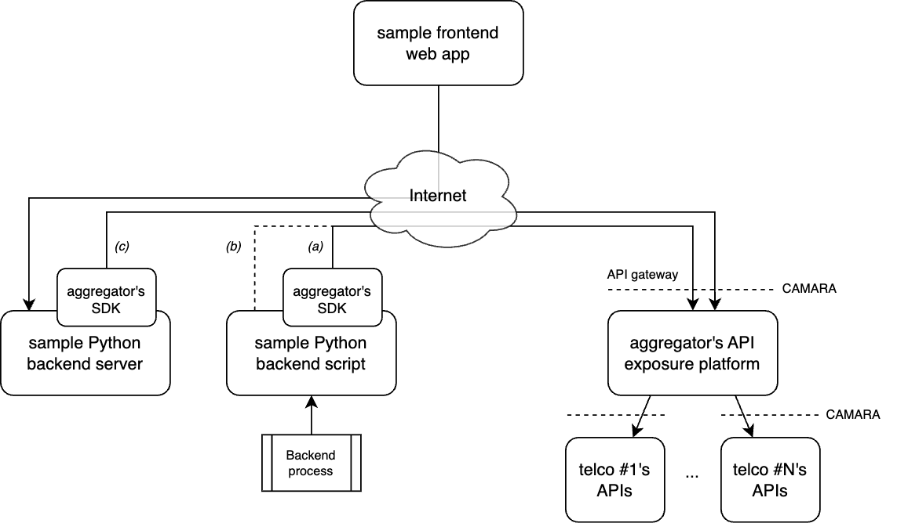

# SIM Swap sample backend application

This sample app showcases how to use the Open Gateway SIM Swap API from a Python backend application. It uses the Telefónica's Open Gateway Sandbox as the testing environment exposing Open Gateway APIs. For additional information on the SIM Swap API, the Open Gateway initiative and Telefónica's resources for developers, please refer to the [parent repository](https://github.com/Telefonica/opengateway-samples-simswap).

## Overview

You will find three Python scripts to test the SIM Swap API consumption in the following ways:
- A command line script taking a phone number as an argument and using the Sandbox's SDK to check for recent SIM card swaps *(a)*
- A version of the same script performing HTTP requests instead of using an SDK *(b)*
- A web server publishing a custom API for a [frontend application](https://github.com/Telefonica/opengateway-samples-simswap-frontend) to offer the SIM Swap functionality on a human interface *(c)*

The following is a high level architecture diagram of the components involved in using Open Gateway APIs applied to this sample app. Note that Telefónica's Open Gateway Sandbox is used for this app as a testing environment, being the final scenario subscribing Open Gateway API products to an Open Gateway channel partner, also known as aggregators:



*[CAMARA](https://camaraproject.org) is the Open Gateway APIs' standardization body*

*Aggregator is an Open Gateway channel partner. This sample app uses the Telefónica's Open Gateway Sandbox as a sandbox aggregator, both its API gateway and its Python SDK*

*The sample command line backend script is versioned both using the Sandbox SDK and performing HTTP requests to the Sandbox API gateway*

*Any of the three options _(a)_, _(b)_, _(c)_ are alternatives and not dependent on each other. Try any of them interchangeably*

## Requirements

To clone and run the sample app scripts:
- [Git](https://git-scm.com/downloads)
- [Python](https://www.python.org/downloads/)

To be able to use the Telefónica Open Gateway Sandbox and its SDK:
- Check how to know and join our programs to get credentials for your app [here](https://github.com/Telefonica/opengateway-samples-simswap#sample-app)

## Dependencies

- Install the [Sandbox's Python SDK](https://pypi.org/project/opengateway-sandbox-sdk/)
```Shell
pip install opengateway-sandbox-sdk
```

- To run the web server version, install Flask
```Shell
pip install -U Flask
pip install -U flask-cors
```

## Configuration

For the sake of simplicity, you will find the following values hardcoded in the scripts. Some of them need to be replaced with the actual values provided when registering your app in the Open Gateway Sandbox, or in your Open Gateway channel partner of choice:

- Your app credentials
	- `APP_CLIENT_ID` and `APP_CLIENT_SECRET`, as obtained from registration

- Your channel partner API exposure platform _(if not using the Sandbox SDK)_
	- `API_GATEWAY_URL`, Sandbox's API gateway URL is included

- The Open Gateway API product to use _(if not using the Sandbox SDK)_
	- `GRANT_TYPE`, leave it fixed for CIBA (check the [parent repository](https://github.com/Telefonica/opengateway-samples-simswap) for information on the authorization flows)
	- `PURPOSE`, leave it fixed for a fraud prevention use case (the one available for the SIM Swap API as an Open Gateway product)

- The IP port to run the web server _(if using the web server version)_
	- `PORT`, default is 8000 but you can change it to any available port on your computer

On a production environment, **be sure to store these values in a secure way**, such as environment variables or a configuration file.

## Usage

### From the command line

Type the following command for any of the two scripts available (the one using the Sandbox SDK or the one performing HTTP requests) providing these arguments:
- 1st argument (mandatory): the phone number to check for recent SIM card swaps (including country code with the + prefix)
- 2nd argument (optional): the number of hours of the recent period that you want to check (default 2400 = 100 days)

#### Using the Sandbox SDK

```Shell
cd command
python simswap-sdk.py +34555555555
```

#### Without an SDK by performing HTTP requests

```Shell
cd command
python simswap-http.py +34555555555
```

### Running as a web server

Follow the steps below to run the web server version of the sample app. The server will be listening on the port you configured. Once your server is running, you can run the sample [frontend application](https://github.com/Telefonica/opengateway-samples-simswap-frontend) to interact with it, and therefore with the Open Gateway SIM Swap API, from a human interface.

```Shell
cd server
python simswap-server.py
```

You can also test your server with the following `curl` commands changing the phone number (including country code with the + prefix) and the number of hours as needed:

```Shell
curl --location 'http://localhost:8000/check/+34555555555/500'
```

```Shell
curl --location 'http://localhost:8000/retrieve_date/+34555555555'
```
